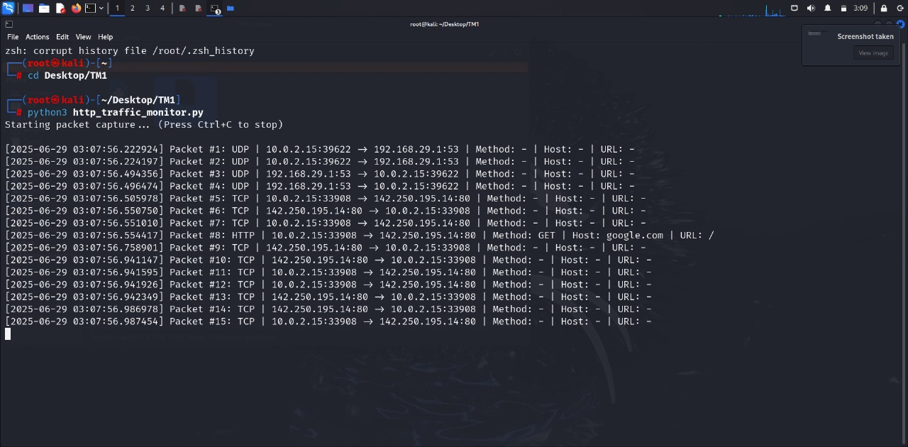
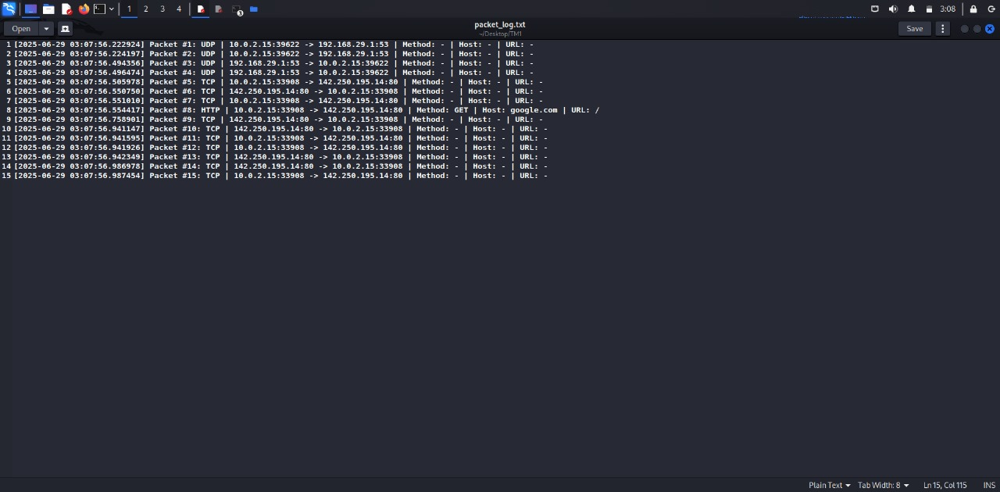

# 🕵️‍♂️ Network Packet Sniffer using Scapy

A lightweight Python tool that uses **Scapy** to sniff and log network packets — with special focus on HTTP requests. Perfect for learning the basics of network security and traffic inspection.

---

## 📖 About the Project

This project is a **command-line-based packet sniffer** that monitors network traffic in real time. It leverages the power of **Scapy**, a powerful Python library for packet manipulation, to capture packets from the network interface and extract key information such as:

- Source & destination IP addresses
- Source & destination ports
- Transport protocol (TCP/UDP)
- HTTP method, host, and URL (for HTTP packets)

All captured information is displayed in the terminal and logged into a file (`packet_log.txt`) with timestamps for further analysis.

🔍 **Use Cases:**
- Learning about network protocols (IP, TCP, UDP, HTTP)
- Capturing HTTP GET/POST requests on your network
- Building a foundation for Intrusion Detection Systems (IDS)
- Testing cybersecurity lab environments like Kali Linux or Wireshark alternatives

⚠️ This is a basic sniffing tool intended for **educational use**. For legal and ethical reasons, use only on networks you own or are permitted to monitor.

---

## 📸 Screenshots

### 🔹 Terminal Output (while sniffing packets)
**File:** `terminal.png`



---

### 🔹 Logged Output in `packet_log.txt`
**File:** `log_ss.png`




---

## 🧠 Features

✅ Logs TCP/UDP/HTTP traffic  
✅ Extracts HTTP method, host, and URL  
✅ Real-time display in terminal  
✅ Saves log to `packet_log.txt`  
✅ Beginner-friendly and minimal

---

## 🛠 Requirements

- Python 3.x
- Scapy

Install Scapy with:

```bash
pip install scapy
